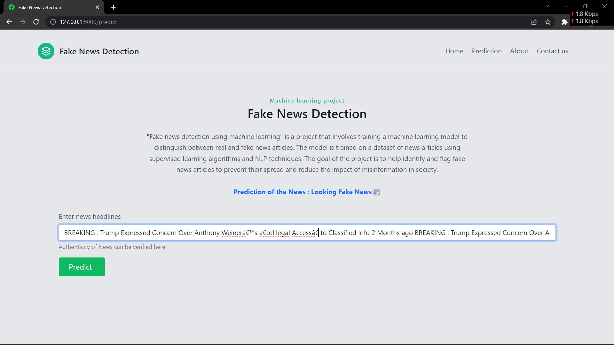

<div align="center">

# 🛡️ FakeGuard
### Fake News Detection using Machine Learning

[](https://python.org)
[](https://flask.palletsprojects.com)
[](https://scikit-learn.org)
[]()
[]()

A real-time fake news detection web application powered by Natural Language Processing and a Passive Aggressive Classifier trained on 20,000+ news articles.


</div>

---

## 📋 Table of Contents

- [Overview](#-overview)
- [Features](#-features)
- [How It Works](#-how-it-works)
- [ML Pipeline](#-ml-pipeline)
- [Project Structure](#-project-structure)
- [Getting Started](#-getting-started)
- [Dataset](#-dataset)
- [Model Details](#-model-details)
- [API Routes](#-api-routes)
- [Screenshots](#-screenshots)
- [Tech Stack](#-tech-stack)
- [Contributing](#-contributing)

---

## 🔍 Overview

FakeGuard is a machine learning-powered web application that classifies news articles as **real** or **fake** in real time. Users paste any news headline or article text into the web interface and receive an instant verdict backed by a model trained on thousands of labeled news samples.

The project was built to demonstrate how NLP preprocessing combined with online learning algorithms can effectively combat misinformation at scale.

---

## ✨ Features

- **Real-time prediction** — instant classification of any news text
- **NLP preprocessing pipeline** — regex cleaning, tokenization, lemmatization, stopword removal
- **96% model accuracy** — trained on 20,000+ labeled articles
- **Input validation** — client-side and server-side checks with clear error messages
- **Sample prompts** — built-in example headlines to test the model quickly
- **Responsive UI** — works on desktop and mobile
- **Auto NLTK setup** — required corpora download automatically on first run
- **Logging** — all predictions are logged server-side for monitoring

---

## ⚙️ How It Works

```
┌─────────────────┐     ┌──────────────────────┐     ┌─────────────────────┐     ┌──────────────┐
│   User Input    │────▶│  Text Preprocessing  │────▶│  TF-IDF Vectorizer  │────▶│  PAC Model   │
│ (news headline) │     │  regex, tokenize,    │     │  (vector.pkl)       │     │  (model.pkl) │
│                 │     │  lemmatize, stopwords│     │                     │     │              │
└─────────────────┘     └──────────────────────┘     └─────────────────────┘     └──────┬───────┘
                                                                                         │
                                                                              ┌──────────▼──────────┐
                                                                              │   Real or Fake?     │
                                                                              │   0 = Real  1 = Fake│
                                                                              └─────────────────────┘
```

### Step-by-step

1. **Input** — User submits a news headline or article body via the web form.
2. **Cleaning** — Non-alphabetic characters are stripped using regex (`[^a-zA-Z\s]`).
3. **Tokenization** — Text is split into individual word tokens using NLTK's `word_tokenize`.
4. **Stopword Removal** — Common English stopwords (e.g. "the", "is", "at") are filtered out.
5. **Lemmatization** — Each token is reduced to its base form using `WordNetLemmatizer`.
6. **Vectorization** — The cleaned token list is transformed into a TF-IDF feature vector.
7. **Prediction** — The Passive Aggressive Classifier outputs `0` (Real) or `1` (Fake).
8. **Response** — The result is rendered back to the user with a color-coded verdict.

---

## 🧠 ML Pipeline

### Text Preprocessing (`preprocess` function)

```python
def preprocess(text):
    text = re.sub(r'[^a-zA-Z\s]', '', text)   # remove non-alpha chars
    text = text.lower()                         # lowercase
    tokens = nltk.word_tokenize(text)           # tokenize
    tokens = [lemmatizer.lemmatize(w)           # lemmatize + remove stopwords
              for w in tokens if w not in stpwrds]
    return ' '.join(tokens)
```

### Why Passive Aggressive Classifier?

The PAC is an **online learning algorithm** — it updates its weights incrementally as new data arrives. This makes it:
- Memory efficient (no need to store all training data)
- Fast to train and predict
- Well-suited for text classification tasks with high-dimensional sparse feature vectors (like TF-IDF)

It is "passive" when the prediction is correct (no update) and "aggressive" when it makes a mistake (large weight update), which helps it converge quickly on noisy data like news text.

---

## 📁 Project Structure

```
Fake-News-Detection/
│
├── app.py                          # Flask app — routes, preprocessing, prediction logic
├── model.pkl                       # Serialized trained PAC model
├── vector.pkl                      # Serialized fitted TF-IDF vectorizer
├── requirements.txt                # Python dependencies
│
├── templates/
│   ├── index.html                  # Landing page with hero section and feature overview
│   └── prediction.html             # Prediction form and result display page
│
├── static/
│   ├── hero_img.svg                # Hero illustration
│   ├── icons8-facebook-ios-16-filled-32.png
│   └── icons8-facebook-ios-16-filled-96.png
│
├── dataset/
│   ├── train.csv                   # Labeled training data (20,800 articles)
│   ├── test.csv                    # Unlabeled test data
│   └── submit.csv                  # Sample submission file
│
├── Fake_News_Detector-PA.ipynb     # Jupyter notebook — EDA, training, evaluation
├── Images/                         # Screenshots and diagrams
└── README.md
```

---

## 🚀 Getting Started

### Prerequisites

- Python 3.8 or higher
- pip

### Installation

**1. Clone the repository**

```bash
git clone https://github.com/abiek12/Fake-News-Detection-using-MachineLearning.git
cd Fake-News-Detection-using-MachineLearning
```

**2. (Optional) Create a virtual environment**

```bash
python -m venv venv

# Windows
venv\Scripts\activate

# macOS / Linux
source venv/bin/activate
```

**3. Install dependencies**

```bash
pip install -r requirements.txt
```

**4. Run the application**

```bash
python app.py
```

**5. Open in browser**

```
http://127.0.0.1:5000
```

> **Note:** NLTK corpora (`stopwords`, `wordnet`, `punkt`) are downloaded automatically on first startup. No manual setup needed.

---

## 📊 Dataset

The model is trained on the [Kaggle Fake News dataset](https://www.kaggle.com/c/fake-news).

### `train.csv` — 20,800 labeled articles

| Column | Type | Description |
|--------|------|-------------|
| `id` | int | Unique article identifier |
| `title` | string | News article headline |
| `author` | string | Author name |
| `text` | string | Full article body (may be incomplete) |
| `label` | int | `0` = Reliable (Real), `1` = Unreliable (Fake) |

### `test.csv` — Unlabeled test set

Same columns as `train.csv` excluding `label`. Used for generating predictions.

---

## 🤖 Model Details

| Property | Value |
|----------|-------|
| Algorithm | Passive Aggressive Classifier |
| Library | scikit-learn |
| Vectorizer | TF-IDF (`TfidfVectorizer`) |
| Accuracy | **96%** |
| Training samples | ~20,800 |
| Output classes | `0` = Real, `1` = Fake |
| Serialization | `pickle` |

### Performance


---

## 🌐 API Routes

| Method | Route | Description |
|--------|-------|-------------|
| `GET` | `/` | Renders the landing page |
| `GET` | `/predict` | Renders the prediction form (empty state) |
| `POST` | `/predict` | Accepts `news` form field, returns prediction result |

### POST `/predict` — Form Parameters

| Field | Type | Required | Description |
|-------|------|----------|-------------|
| `news` | string | Yes | News headline or article text (min 5 characters) |

### Response

The route renders `prediction.html` with the following template variables:

| Variable | Type | Description |
|----------|------|-------------|
| `prediction_text` | string | Human-readable verdict string |
| `is_fake` | bool | `True` if fake, `False` if real, `None` if no prediction |
| `error` | string | Validation or runtime error message, or `None` |

---

## 📸 Screenshots

**Prediction — Real News**


**Prediction — Fake News**



---

## 🛠️ Tech Stack

| Layer | Technology |
|-------|-----------|
| Language | Python 3.8+ |
| Web Framework | Flask |
| ML Library | scikit-learn |
| NLP | NLTK (tokenization, lemmatization, stopwords) |
| Vectorization | TF-IDF (`sklearn.feature_extraction.text`) |
| Frontend | Bootstrap 5, Bootstrap Icons, Inter (Google Fonts) |
| Templating | Jinja2 |
| Serialization | pickle |

---

## 🤝 Contributing

1. Fork the repository
2. Create a feature branch — `git checkout -b feature/your-feature`
3. Commit your changes — `git commit -m "Add your feature"`
4. Push to the branch — `git push origin feature/your-feature`
5. Open a Pull Request

---

## 📄 License

This project is licensed under the MIT License.

---

<div align="center">
  Made with ❤️ for fighting misinformation
</div>
